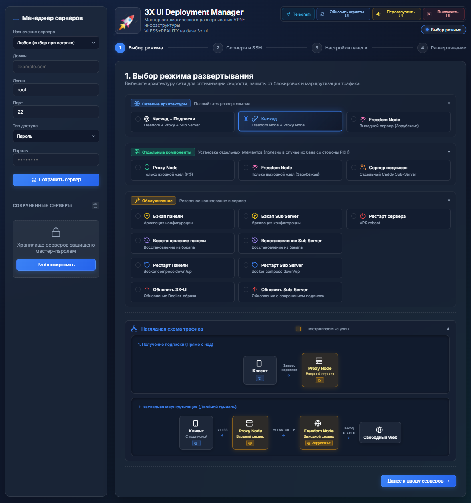
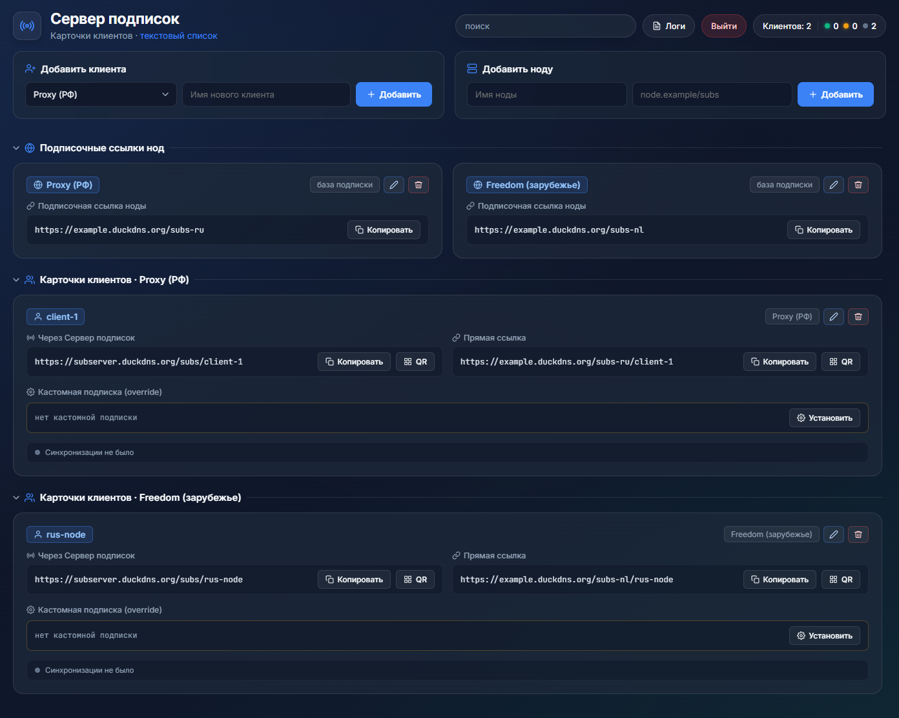

# 3x-ui Deployment Manager

[](https://t.me/drei_x_ui_bootstrup)

## 🚀 Быстрый запуск 3x-ui Deployment Manager'а

### ⚠️ Запускать нужно на вашем личном компьютере

### 🐧 🍎 Linux / macOS (Bash / Zsh)
```bash
curl -fsSL https://github.com/honmiv/3x-ui-bootstRUp/archive/refs/heads/master.tar.gz | tar -xz && cd 3x-ui-bootstRUp-master && ./start_3x_ui_deployment_manager.sh
```

### 💻 Windows CMD (cmd.exe)
```cmd
curl -fsSL https://github.com/honmiv/3x-ui-bootstRUp/archive/refs/heads/master.zip -o 3x-ui.zip && powershell -Command "Expand-Archive -Path '3x-ui.zip' -DestinationPath '.' -Force" && cd 3x-ui-bootstRUp-master && start_3x_ui_deployment_manager.bat
```

### ⚡ Windows PowerShell
```powershell
iwr -useb https://github.com/honmiv/3x-ui-bootstRUp/archive/refs/heads/master.zip -OutFile 3x-ui.zip; Expand-Archive 3x-ui.zip -DestinationPath . -Force; cd 3x-ui-bootstRUp-master; .\start_3x_ui_deployment_manager.ps1
```


## ✨ Возможности

- **Удалённый деплой 3x-ui** — развёртывание панели на VPS с подключением по SSH (пароль или SSH-ключ)
- **Автоустановка ПО на удалённом сервере** — скрипт можно запускать сразу после создания VPS у провайдера
- 🌐 **Собственный сервер подписок** — единая ссылка клиента на подписку остаётся доступной даже при блокировке VPN-сервера. Всех пользователей можно единоразово перевести на другие ноды: переразвернуть сервер подписок или изменить назначения серверов в его веб-интерфейсе.
  - **Поддержка JSON-подписок (Sing-box/Xray)** наряду со стандартными vless:// ссылками
  - **Динамическая балансировка**: возможность объединять две ноды с JSON-подпиской в единую конфигурацию для клиента, обеспечивая распределение трафика
  - **Продвинутая маршрутизация (Routing)**: правила обхода блокировок (на базе *hydraponique/roscomvpn-routing*) применяются автоматически как к обычным (только happ), так и к JSON-подпискам
- **Режимы развёртывания:**
  - 🟢 **Single** — подразумевается, что 3x-ui панель будет развернута на зарубежном сервере для доступа к заблокированным ресурсам. Трафик на RU (geoip:ru \ geosite:category-ru заблокирован)
  - 🔗 **Cascade** — каскад из двух нод:
    - Зарубежная (freedom) — трафик на RU (geoip:ru \ geosite:category-ru) заблокирован
    - Локальная (Proxy) — трафик на RU (geoip:ru \ geosite:category-ru) идёт напрямую, остальной трафик идёт на зарубежную ноду
  - 📦 **Cascade + Subscription Server** — каскад с развёртыванием отдельного саб-сервера
  - 🛰 **Freedom + Sub Server** — зарубежная нода с собственным сервером подписок, без прокси-ноды. Подходит для регионов без DPI или как замена при бане прокси-ноды
  - 📡 **Sub-only** — автономный сервер подписок для уже настроенной панели
  - 🔧 **Proxy-only / Freedom-only** — развёртывание только одного компонента каскада. Полезно при замене забаненой ноды
- **Сайт-заглушка (Decoy)** — маскировка сервера под обычный сайт для защиты от активного пробинга ТСПУ/DPI:
  - 23+ встроенных заглушки (игры, корпоративные лендинги, портфолио, блоги и др.)
  - Выбор заглушки при деплое панели и сервера подписок
  - Обновление заглушки на уже развёрнутом сервере без перезапуска
  - Предпросмотр сайта-заглушки в браузере перед деплоем
  - Автоматическая микро-рандомизация (Anti-Fingerprinting): уникальный SHA-256 хэш страницы для каждого инстанса
- **Генерация клиентов** — массовое создание клиентов через списки для протоколов **vless + TCP (Reality)** и **vless + XHTTP (Reality)**
- **Генерация клиентов и JSON-подписки** — массовое создание клиентов через списки для протоколов **vless + TCP (Reality)** и **vless + XHTTP (Reality)**. Встроенная поддержка JSON-подписок как в самой панели 3x-ui, так и на сервере подписок.
- **Бэкапы** — полезно при переносе панелей с забаненых серверов без потери настроек:
  - 💾 Создание бэкапа панели и саб-сервера на удалённом сервере с загрузкой архивов на локальную машину (`backups_panel/`, `backups_sub_server/`)
  - ♻️ Восстановление из бэкапа на новом сервере с автозаменой домена
- **Обновление 3x-ui** — выбор версии из актуального списка, автоматический бэкап перед обновлением
- **Обслуживание** — перезапуск панели, перезапуск сервера, перезапуск саб-сервера в один клик
- **Проверка SSH-подключения** до начала любых операций
- **Кроссплатформенность** — запуск на Windows (CMD/PowerShell), Linux и macOS (Bash/Zsh)
- **Менеджер серверов** — локальное сохранение и быстрое переиспользование данных подключения (PIN-шифрование, drag-and-drop заполнение форм)

> ⚠️ **Важно:** при настройке панелей не используются никакие сторонние сервисы. Всё происходит на вашей локальной машине и на серверах, которые вы указали.
---
### 3x-ui Deployment Manager
#### Настройка 3x-ui на удалённых серверах с помощью удобного веб интерфейса

### Сервер подписок
#### Прокси для подписок VLESS - позволяет не менять url подписки при блокировке VLESS-сервера

---

## 🧭 Маршрутизация трафика

Проект реализует двухуровневую систему маршрутизации (на клиенте и на серверах), обеспечивая прозрачный обход блокировок, максимальную скорость доступа к отечественным сервисам и защиту от выявления VPN.

### 1. Клиентская маршрутизация

Клиентские правила построены на базе профиля *hydraponique/roscomvpn-routing* и автоматически передаются в клиентские приложения вместе с подпиской:
- **Happ-подписки**: правила передаются в заголовке `Routing: happ://routing/onadd/...` и автоматически применяются клиентом при добавлении подписки.
- **JSON-подписки (Sing-box / Xray)**: сервер подписок (или панель 3x-ui) преобразует правила в нативную структуру JSON (`dns`, `route.rules` / `routing.rules`, `outbounds`, `balancers`).

#### Принцип работы клиентских правил:
- **Раздельный DNS (DoH)**:
  - Российские домены (`.ru`, `.рф`) резолвятся через Яндекс DNS (`77.88.8.8`) по HTTPS.
  - Остальные домены резолвятся через Google DNS (`8.8.8.8`) по HTTPS.
  - Статические сопоставления (`DnsHosts`) для критичных ресурсов (например, `nalog.ru`).
- **Прямое соединение (Direct — в обход VPN)**:
  - Российские доменные зоны (`domain:ru`, `domain:xn--p1ai`) и базы `geosite:category-ru`, `geosite:whitelist`.
  - Популярные сервисы и игры без ограничений: `microsoft`, `apple`, `steam`, `epicgames`, `riot`, `escapefromtarkov`, `twitch`, `pinterest`, `faceit`.
  - Локальные сети (`geoip:private`).
  - Сервисы определения IP и чекеры (`2ip.ru`, `whoer.net`, `yandex`, `speedtest`, `ipinfo.io` и др.) направляются напрямую, чтобы приложения с защитой от VPN (банковские клиенты, MAX и др.) видели реальный российский IP и не блокировали доступ.
- **Блокировка (Block)**:
  - Телеметрия и сбор данных Windows (`win-spy`).
  - Торрент-трекеры (`torrent`).
  - Рекламные сети (`category-ads`).
- **Проксирование (Proxy)**:
  - Заблокированные и зарубежные ресурсы (`youtube`, `telegram`, `github`, `google-play` и весь остальной трафик по умолчанию через `GlobalProxy: true`).
- **Балансировка нагрузки (Load Balancing)**:
  - При объединении двух нод в единую JSON-подписку на сервере подписок правила автоматически направляют проксируемый трафик на балансировщик между серверами.
- **Кастомизация правил**:
  - Файл конфигурации: [panel/templates/3x-ui/happ-routing.json](file:///home/honmiv/dev/3x-ui-bootstRUp/panel/templates/3x-ui/happ-routing.json).
  - В веб-интерфейсе менеджера (Шаг 3) встроен интерактивный редактор с проверкой валидности JSON.

---

### 2. Маршрутизация на Proxy и Freedom нодах

Маршрутизация на узлах сети работает на уровне Xray-ядра 3x-ui с интеграцией кастомных геобаз Hydraponique (`geoip-hydraponique.dat` и `geosite-hydraponique.dat`), которые автоматически обновляются ежедневно по cron в 04:00.

```
[Клиент]
   │
   │ VLESS Reality (Port 443)
   ▼
┌──────────────────────────────────────────────────────────┐
│ PROXY NODE (РФ VPS)                                      │
│                                                          │
│  ├─► RU трафик / Whitelist / Игры ──► DIRECT (Интернет)  │
│  │   (geoip:ru, category-ru, steam, apple, ...)          │
│  │                                                       │
│  ├─► BitTorrent / Шпионское ПО / Ads ─► BLOCKED          │
│  │                                                       │
│  └─► Зарубежный / Заблокированный трафик                 │
│      (inbound-tcp, inbound-xhttp)                        │
│             │                                            │
└─────────────┼────────────────────────────────────────────┘
              │ VLESS туннель (outbound-subs)
              ▼
┌──────────────────────────────────────────────────────────┐
│ FREEDOM NODE (Зарубежный VPS)                            │
│                                                          │
│  ├─► RU трафик (geoip:ru, category-ru) ──► BLOCKED      │
│  ├─► BitTorrent / Torrent / Ads / Spy  ──► BLOCKED      │
│  ├─► Приватные сети (geoip:private)    ──► BLOCKED      │
│  │                                                       │
│  └─► Весь остальной трафик ─────────────► DIRECT         │
│                                           (Свободный Инет)│
└──────────────────────────────────────────────────────────┘
```

#### Freedom нода (зарубежный сервер):
- **Назначение**: безопасный выход в свободный интернет без цензуры.
- **Блокировка трафика в РФ (`blocked`)**:
  - Правила принудительно блокируют `geoip:ru` и `geosite:category-ru`.
  - *Причина*: российские государственные сервисы и банки часто блокируют доступ с иностранных IP. Блокировка RU-трафика на выходном сервере исключает проблемы с доступом к отечественным ресурсам, защищает сервер от лишней нагрузки и снижает риск детекта.
- **Защита сервера**:
  - Блокировка протокола `bittorrent` и трекеров (защита от жалоб правообладателей и абуз хостинг-провайдера).
  - Блокировка приватных диапазонов (`geoip:private`), рекламы (`category-ads`) и телеметрии (`win-spy`).
- **Выход в сеть (`direct`)**: весь разрешённый зарубежный трафик отправляется напрямую в интернет.

#### Proxy нода (российский сервер в каскаде):
- **Назначение**: точка входа для пользователя, фильтрация и ускорение локального трафика, туннелирование зарубежных запросов.
- **Прямой выход (`direct`)**:
  - Российские IP-адреса (`geoip:ru`, `ext:geoip-hydraponique.dat:direct`).
  - Российские домены и доверенные сервисы (`geosite:category-ru`, `whitelist`).
  - Сервисы без блокировок: `microsoft`, `apple`, `steam`, `epicgames`, `riot`, `escapefromtarkov`, `twitch`, `pinterest`, `faceit`.
  - Трафик к этим сервисам идёт напрямую с российского IP на скорости провайдера с минимальным пингом.
- **Блокировка (`blocked`)**: `bittorrent`, `geoip:private`, `win-spy`, `torrent`, `category-ads`, сервисы проверки IP.
- **Каскадное туннелирование**:
  - Весь остальной трафик с клиентских Reality-портов (`in-...-tcp` и `in-...-xhttp`) направляется через `outboundTag` на зарубежную Freedom ноду.
  - Подключение к Freedom ноде настраивается автоматически через встроенный механизм `outbound-subs` панели 3x-ui и обновляется каждые 10 минут.
- **Маскировка**: для провайдера соединение выглядит как защищённый TLS-трафик до сайта-заглушки (Nginx Decoy) на российском сервере.
