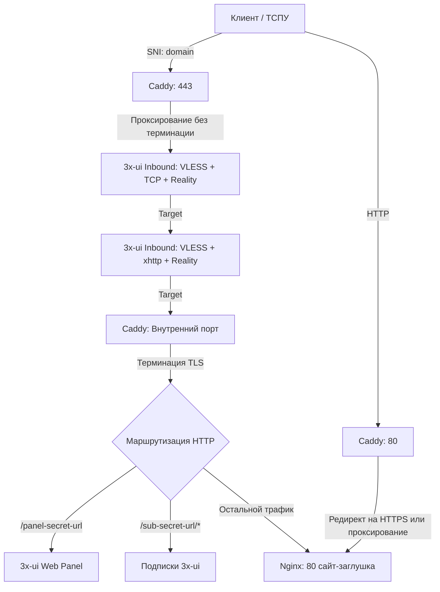

# 3x-ui + Caddy + Nginx: Secure Multiplexing Setup

Данный репозиторий содержит скрипт для автоматизированной и безопасной настройки 3x-ui с использованием Caddy в качестве фронт-прокси и Nginx для обслуживания сайта-заглушки. Все подключения мультиплексируются на одном домене и порту, маскируя VPN-трафик под обычные веб-запросы.

Конфигурация устойчива к активному зондированию и успешно проходит сканирование утилитой детекта прокси-протоколов [ByeByeVPN](https://github.com/pwnnex/ByeByeVPN): Статус: **100/100 CLEAN**


<h2>Установка</h2>

```shell
curl -fsSL https://raw.githubusercontent.com/honmiv/3x-ui-bootstRUp/master/install.sh | bash
```

<h2>Требования</h2></summary>

* **ОС (Протестировано на):** Ubuntu 26.04, Debian 13, CentOS 9
* **Настройка домена:** Направьте доменное имя на IP-адрес VPS:
* **A-запись** для всех IPv4 адресов
* **AAAA-запись** для всех IPv6 адресов (если предоставляются вашим VDS-провайдером)

* **Порты:** `80` и `443` должны быть свободны
* **Зависимости:** установленные `curl`

<details>
<summary><h2>Особенности архитектуры</h2></summary>

Все обращения (VPN, веб-панель, подписки, сайт-заглушка) используют один домен с единым SNI (`sni=domain`). Выпуск и обновление TLS-сертификатов автоматически управляется через Caddy.

Обработка входящего трафика на порт 443 построена на цепочке маршрутов:

1. Входящий запрос поступает на **Caddy** (`domain:443`).
2. Caddy маршрутизирует трафик на inbound **3x-ui (VLESS + TCP + Reality)** без терминации TLS.
3. Если запрос не является клиентским TCP-подключением, он перенаправляется на inbound **VLESS + xhttp + Reality**.
4. Если запрос не является xhttp-подключением, TLS по-прежнему не терминируется, и трафик перенаправляется обратно на **внутренний порт Caddy**.
5. На внутреннем порту **Caddy терминирует TLS**. Расшифрованный HTTP-трафик маршрутизируется на панель 3x-ui, подписки или на **Nginx:80** (легитимный сайт-заглушка).

Для систем DPI (ТСПУ) любой неавторизованный запрос выглядит как стандартное обращение к HTTPS-сайту.
</details>

<details>
<summary><h2>Схема потоков данных</h2></summary>


</details>

<details>
<summary><h2>Маршрутизация (Endpoints)</h2></summary>
Для клиента и администратора структура точек доступа выглядит следующим образом:

| Запрос / Подключение | Результат |
| --- | --- |
| `domain:80` | Сайт-заглушка (Nginx) |
| `domain:443` (обычный браузер/curl) | Сайт-заглушка (Nginx) |
| `domain:443/panel-secret-url` | Панель управления 3x-ui |
| `domain:443/sub-secret-url/{client-name}` | Ссылка на конфигурацию подписки клиента |
| `domain:443` (протокол xhttp) | VPN-соединение: VLESS + xhttp |
| `domain:443` (протокол TCP) | VPN-соединение: VLESS + TCP |

</details>

<details>
<summary><h2>Как работает скрипт установки (`setup.sh`)</h2></summary>

Скрипт полностью автоматизирует процесс развертывания, выполняя следующие шаги:

1. **Проверка окружения и установка зависимостей:**
* Проверяет наличие прав `root`.
* Определяет пакетный менеджер (`apt`, `dnf`, `yum`, `pacman`) и ожидает снятия его блокировок.
* Доустанавливает недостающие утилиты (jq, openssl, ss, qrencode и др.).
* Устанавливает Docker и Docker Compose (если отсутствуют). Для пользователей из РФ автоматически настраивается резервное зеркало реестра (`dh-mirror.gitverse.ru`).


2. **Динамическая генерация конфигурации:**
* Автоматически подбирает свободные внутренние порты, генерирует криптографические ключи (X25519) и безопасные URL-пути для панели и подписок.
* Процессит исходные шаблоны (`templates`), подставляя в них сгенерированные параметры, и преобразует их в полноценные рабочие файлы конфигурации.


3. **Автоматизация настройки 3x-ui:**
* Запускает контейнер 3x-ui и настраивает его через API без ручного вмешательства: обновляет учетные данные администратора, применяет пути маршрутизации, создает Inbound-подключения (VLESS TCP и xhttp Reality) и заводит нового VPN-клиента.


4. **Запуск маршрутизации и валидация:**
* Запускает Caddy и активно ожидает успешного выпуска и применения SSL/TLS сертификата (проверяя доступность HTTPS на 443 порту).
* Получает и декодирует данные подписки, извлекая итоговые ссылки на подключение.


5. **Интеграция:**
* Выводит ссылки и QR-коды для подключения.
* Добавляет скрипт в `/etc/profile.d/3x-ui.sh`, который выводит адрес и учетные данные панели при каждом SSH-входе на сервер.
</details>

## Примечания

* Перенаправление нецелевого трафика между inbound-ами (от TCP к xhttp и далее на внутренний порт Caddy) реализовано через поле `target`, а не через механизм `fallbacks` последних версий 3x-UI.
* Добавление/удаление inbound'ов требует аккуратной настройки target в inbound'ах.
* Удаление vless+tcp+reality inbounda без добавления inbounda с тем же портом потребует правки Caddyfile.

## Обновлние панели
Чтобы обновить панель на конкретную версию:
```bash
./update 3.3.1
```
Чтобы обновить панель на последнюю версию:
```bash
./update latest
```

## Откатить обновление
Чтобы откатить обновление, если что-то сломалось:
```bash
./rollback_update
```